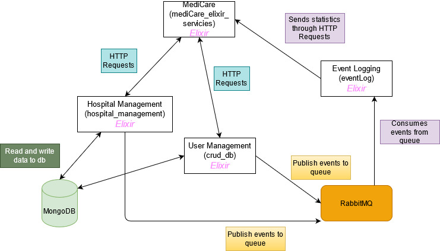

# MediCare Elixir Services

Hospital management app, developed in Elixir, where users can manage their treatments, appointments, feedbacks.

# Arhitecture

 


## Installation

If [available in Hex](https://hex.pm/docs/publish), the package can be installed
by adding `api_test` to your list of dependencies in `mix.exs`:

```elixir
def deps do
  [
    {:api_test, "~> 0.1.0"}
  ]
end
```

Run the following commands on all 3 services

> mix deps.get, deps.compile, compile

and then register, log in, send requests for the resources specified.

Documentation can be generated with [ExDoc](https://github.com/elixir-lang/ex_doc)
and published on [HexDocs](https://hexdocs.pm). Once published, the docs can
be found at [https://hexdocs.pm/api_test](https://hexdocs.pm/api_test).

